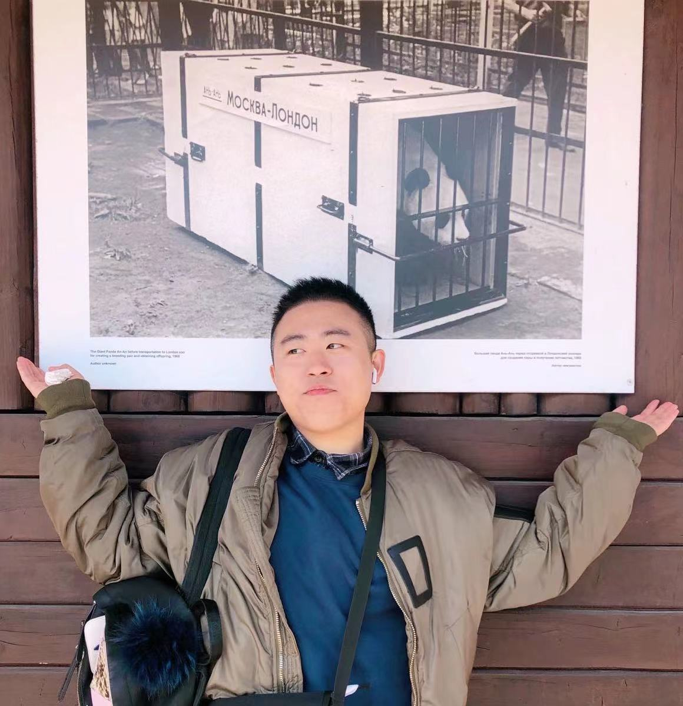

## About Me

Hi! I am a Ph.D. student in the Thrust of Earth, Ocean and Atmospheric Sciences at the Hong Kong University of Science and Technology, Guangzhou.

Before joining HKUST(GZ) in Sept. 2022, I did my master's research in the [School of Oceanography](https://soo.sjtu.edu.cn/), [Shanghai Jiao Tong Universiy](https://www.sjtu.edu.cn/), working with [Prof. Zhaoru Zhang](https://soo.sjtu.edu.cn/szTeachers/3589.html). I did some work in the Air-Ice-Sea interaction processes in the Southern Ocean (see my publications). I received my bachelor's degree of Petroleum Engineering in the [School of Petroleum Engineering](http://pe.upc.edu.cn/), [China University of Petroleum (East China)](https://www.upc.edu.cn/).

Now I am doing some Large Eddy Simulations in coastal sea surface and bottom boundary merging processes under the guidance of [Prof. Qing Li](https://qingli411.github.io/index.html).

## Academic activities

1. Ocean Sciences Meeting, Online, 2022 (Poster)
2. Annual Conference of Chinese Polar Science, Shanghai, 2021 (Oral) 
3. The 7th Young Scientist Forum of Earth Science, Guiyang, Guizhou, 2021 (Oral)
4. The 3rd Symposium on Space Earth Science, Zhuhai, Guangdong, 2020 (Poster)

## Publications

1. **Wei, Z.**, Z. Zhang*, T. Vihma, X. Wang and Y. Chen (2021). An Overview of Antarctic coastal polynyas: sea ice production, forcing mechanisms, temporal variability, and water mass formation. Advances in Polar Science, 32(4), 292-308.
2. **Wei, Z.**, Z. Zhang*, X. Wang, Y. Chen and M. Zhou (2022). The thermodynamic and dynamic control of the sensible heat polynya in the western Cosmonaut Sea. Deep-Sea Research Part II: Topical Studies in Oceanography, 195, 105000.

## Something to be continued and explored...

......
